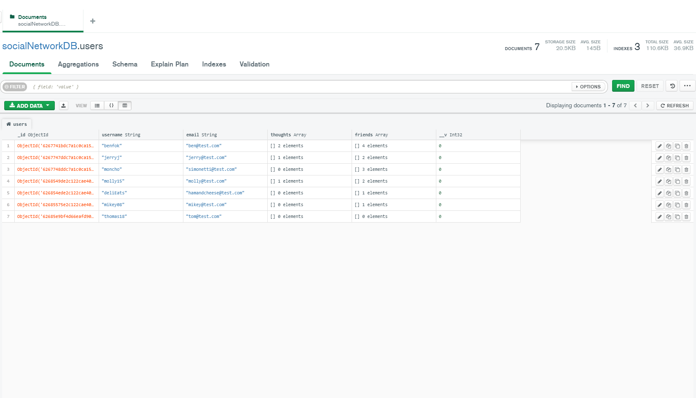
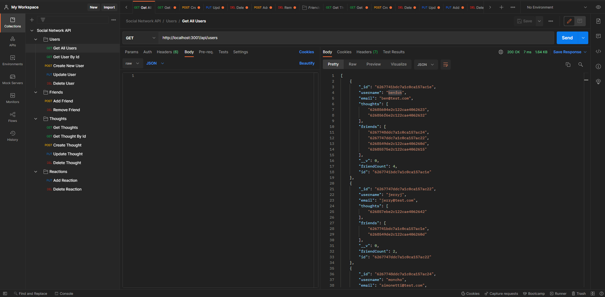

# social-network-api

## Description
An example API for a fictious social network built to leverage a NoSQL database. This back-end-only app showcases the use of **mongoose** as an ODM tool for performing CRUD operations on a MongoDB. The database is setup with too document structures, Users and Thoughts. Users have Friends and post Thoughts. Thoughts also contain Reactions from different Users. The app is written entirely in Javascript with the help of express and Node.js to initialize a web server. I use MongoDB Compass and Postman to view the data and showcase how the routes and CRUD operations work in the video walkthroughs below.

<strong>Table of Contents</strong>

- [Installation](#installation)
- [Usage](#usage)
- [License](#license)
- [Contributing Guidelines](#contributing-guidelines)
- [Tests](#tests)
- [Languages, Skills and Credits](#languages-skills-and-credits)
- [Screenshots and Walkthrough Videos](#screenshots-and-walkthrough-videos)
- [Questions and Links](#questions-and-links)
- [Details and Learnings](#details-and-learnings)

## Installation
### Local Installation
- Clone the repo.
- Navigate to the folder and run `npm init` followed by `npm install` in order to install the dependencies.
- Be sure to add a MONGODB_STRING including a database name to the .env.EXAMPLE file and rename to .env.
- Use the command `npm run start` to start the server.
- The server is pointed to http://localhost:3001/.

## Usage
As mentioned above because this is back-end only, an application like Postman or Insomnia will be needed to view and test the different routes.

## License
Distributed under the **MIT** license.

## Contributing Guidelines
Contributions help our open source community to continue to evolve, and any contributions are greatly appreciated. If you have a suggestion that would improve this code please follow the directions below. I require that any and all changes adhere to the Code of Conduct outlined in the [Contributor Covenant](https://www.contributor-covenant.org/).

 - Fork the repo
 - Create your feature branch
 - Commit your changes
 - Push the branch and open a pull request

> _**Note:** Any contributions are understood to be under the same MIT that covers the project. If this is a concern please contact me._

## Tests
There are currently no tests written for this application.

## Languages, Skills and Credits
- JavaScript
- Node.js
- Dependencies:
  - [express](https://www.npmjs.com/package/express) as a web framework for Node.js.
  - [dotenv](https://www.npmjs.com/package/dotenv) used to host credentials in an environment file 
  - [mongoose](https://mongoosejs.com/) ODM for creating database schemas and models and simplifying the interaction with the Mongo DB.

## Screenshots and Walkthrough Videos
Here are a couple of screenshots showing the Users document through Compass and the routes in Postman

### Walkthrough Videos
1. [File structure and backend](https://drive.google.com/file/d/1ge40QouvIPfoG8qCy4nBtBNW5lFKz-G7/view?usp=sharing)
2. [Data Overview and Read operations](https://drive.google.com/file/d/1v9VYGCFW9WnhtoRZvX6fdZaxI60E82EF/view?usp=sharing)
3. [CRUD operations video 1](https://drive.google.com/file/d/1J7h_LIT8hDprvabfxGW2MkdwTeL1AuUq/view?usp=sharing)
4. [CRUD operations video 2](https://drive.google.com/file/d/1AbNgwnfhflzC8f2VT7erTx_xv1zDRsRK/view?usp=sharing)
5. [CRUD operations video 3](https://drive.google.com/file/d/1IP4k1vHsDE63MWLcTqA2lkKFyP36RS2t/view?usp=sharing)

## Questions and Links
Please reach out with any questions regarding the application.

View the repository in [GitHub](https://github.com/benfok/social-network-api)

## Details and Learnings
- Appreciated the simplicity of setting up the schemas and models, compared to a relational database. A trade off is more manual work to relate data within the routes, especially when having to manually cascade delete and update operations.
- I had to be thoughtful about how to connect data to ensure an update in one area did not render a piece of data obsolete unintentionally. As an example I did not include 'username' alongside userId within the body object passed in when creating a thought and instead pulled this from the DB using the userId. This reduced one area of potential data corruption. 
- Another choice was to restrict user updating to not allow the username to be updated after creation. Should this functionality be desired, additional logic to manually cascade those changes through the Thoughts and Reactions documents would be required.
- Currently deleting a user does not remove them from the friends array of other users (not in original scope).
 

